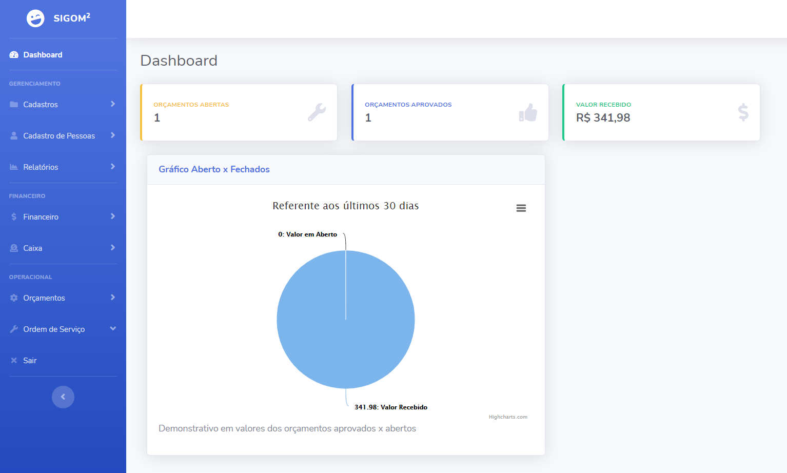
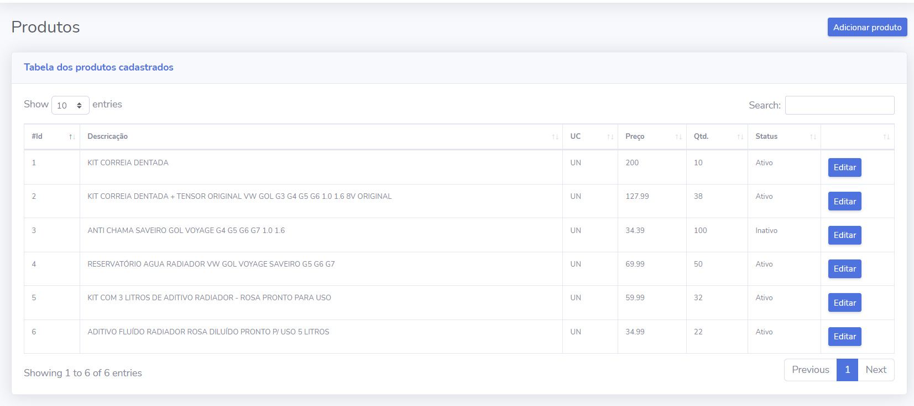
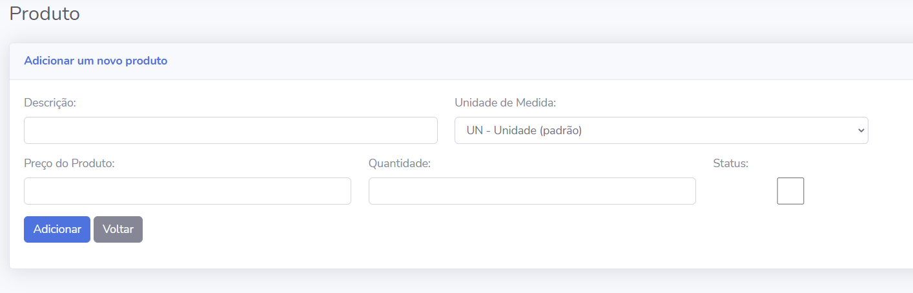
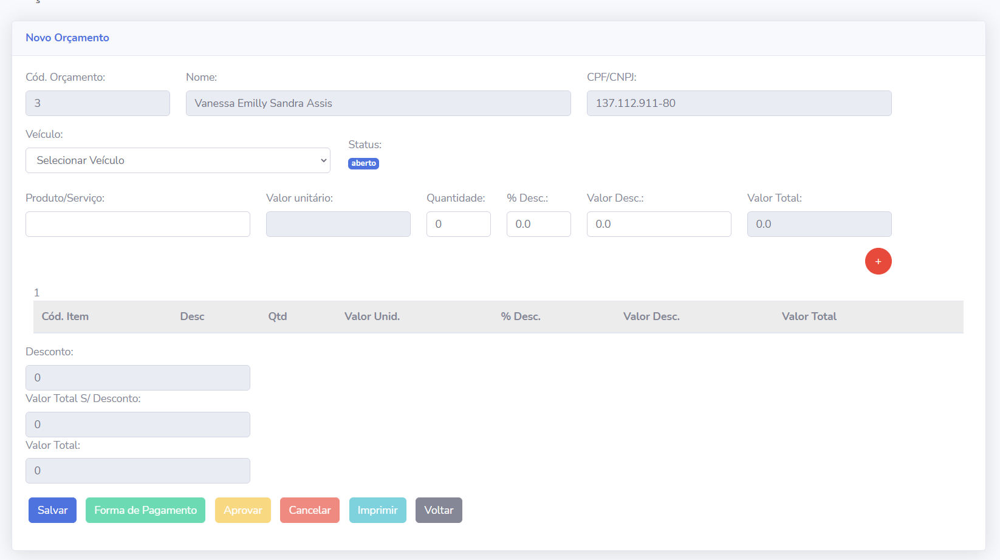
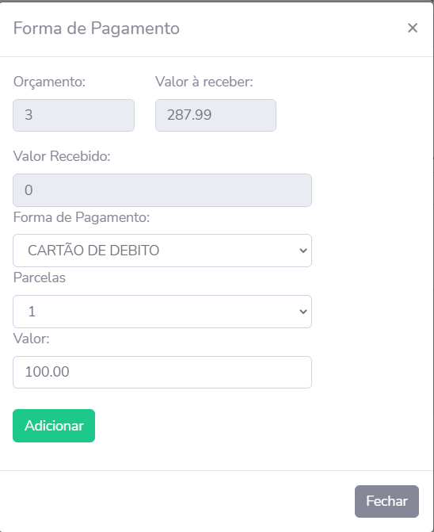
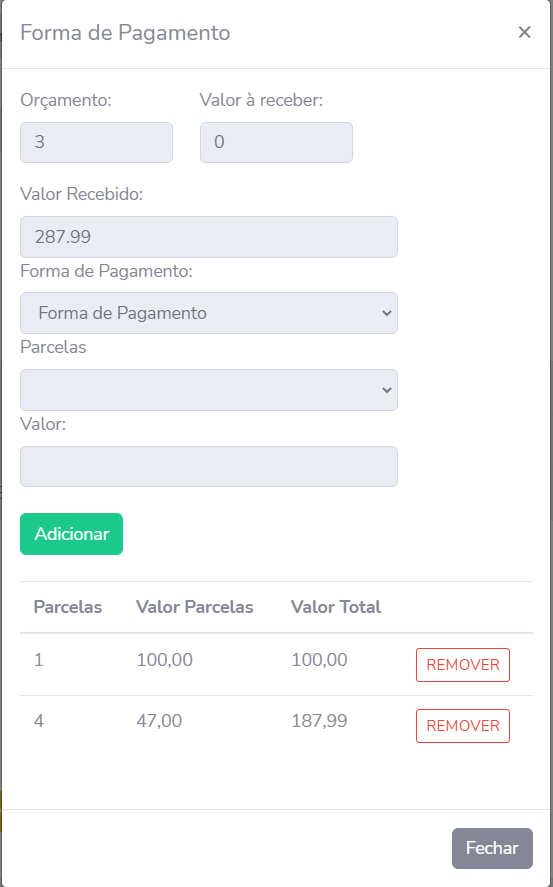
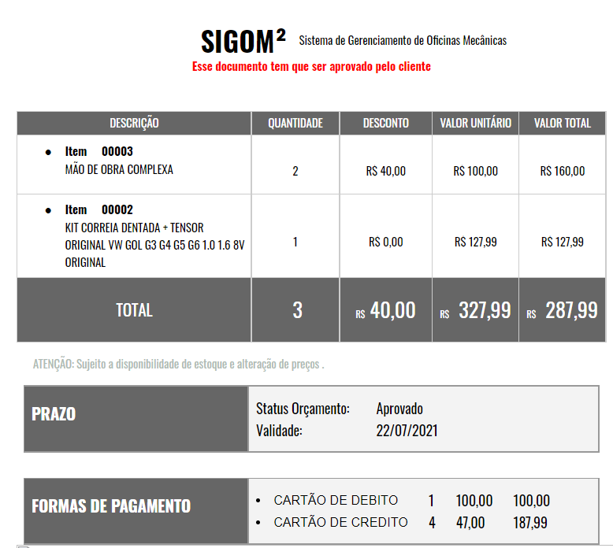

## SIGOM

O SIGOM foi desenvolvido para atender os requisitos da materia de Projeto Interdisciplinar, do curso de Analise e desenvolvimento de sistemas, da faculdade FANAP - Aparecida de Goiânia - GO.

## Como instalar a aplicação.

Download .zip e extrair em alguma pasta local.

Criar um banco de dados no MySQL Ex.: create database zeppelin.

No arquivo .env e adicionar as informações referente ao seu banco.

DB_CONNECTION=mysql  
DB_HOST=127.0.0.1  
DB_PORT=3306  
DB_DATABASE=zeppelin  
DB_USERNAME=root  
DB_PASSWORD=  

Após alteração no arquivo .env salve o arquivo. Executar os comandos abaixo via cmd ou shell na pasta do projeto. 

php artisan migrate   
php artisan db:seed  

Executar o script SCRIPT_001_004.SQL no banco de dados criado anteriomente (zeppelin), nesse script contem a criação de VIEW's, PROCEDURE, TRIGGER e FUNCTIONS. O script SCRIPT_001_002.SQL é opcional (inserção na tabela de pessoas).

Por fim, executar o comando php artisan serve para iniciar a aplicação laravel.

php artisan serve  

Como pré-requisito ter instalado o PHP7, Composer, Laravel e o MySQL.

## Utilização

Usuário e senha pardão  
Usuário: admin@admin.com  
Senha: 123456

Dashboard da aplicação.

Listagem de Produtos.

Cadastro de um novo produto.

Tela de orçamento.

Vinculação da forma de pagamento ao orçamento

Impressão do orçamento.

## About Laravel

Laravel is a web application framework with expressive, elegant syntax. We believe development must be an enjoyable and creative experience to be truly fulfilling. Laravel takes the pain out of development by easing common tasks used in many web projects, such as:

- [Simple, fast routing engine](https://laravel.com/docs/routing).
- [Powerful dependency injection container](https://laravel.com/docs/container).
- Multiple back-ends for [session](https://laravel.com/docs/session) and [cache](https://laravel.com/docs/cache) storage.
- Expressive, intuitive [database ORM](https://laravel.com/docs/eloquent).
- Database agnostic [schema migrations](https://laravel.com/docs/migrations).
- [Robust background job processing](https://laravel.com/docs/queues).
- [Real-time event broadcasting](https://laravel.com/docs/broadcasting).

Laravel is accessible, powerful, and provides tools required for large, robust applications.
